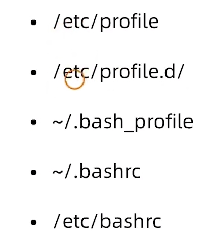

# Shell

## 执行

chmod u-rx filename 赋予sh文件可执行权限

* 系统会另起一个执行进程(不会对当前进程造成影响)

  * 用bash运行 （ubuntu 默认bash）
    * bash test.sh 

  * 用系统自带的运行
    * ./test.sh

* 在当前进程执行(会对当前进程造成影响)
  * source ./test.sh
  * ./test.sh

## # 注释

```shell
./系统自带运行，表示使用bin下的bash运行 #起到声明的作用
!/bin/bash 

正常情况下起到注释的作用
# test
```

## | 管道

**将前一个指令的结果传递给后面的指令**

**管道符创建的子进程无法影响父进程（当前shell环境）的工作目录**

```shell
echo hello shell | cat
```

## 重定向

### < 输入

```
wc -l < /etc/passwd
```

### > 输出

* **>** : 覆盖

* **>>**: 追加

* **2>**: 错误重定向，如果当前出现错误，将错误信息输出到目标文件

  ```
  nocmd 2> error.text
  ```

* **&>**: 无论输出的是什么信息，都输出到目标文件

  ```shell
  #!/bin/bash
  # test shell file
  
  # <<EOF 告诉shell 后面的内容都作为a.sh的输入，直到遇到EOF结束
  cat > ./a.sh <<EOF
  echo "hello bash"
  EOF
  ```
  

## 变量
### 变量使用
**shell中的变量不区分类型**
```shell
#不能有空格
a=123

#let 为变量赋值(性能最低)
let a=10+20
#双圆括号 let的简化写法
((a=10+20)) 

#将命令赋值给变量
l=ls

#将命令结果赋值给变量,$()/`` (letc是变量名称)
letc=$(ls -l/etc)
```
### 变量引用
**${变量名}**
```shell
创建变量
string1="hello world"

输出变量
echo ${string1}
echo $string1

```
## 变量作用范围
**只在当前进程，用source运行可以使运行的sh作用到当前终端中**
### export
**子进程得到父进程的变量**
```shell
export [定义好的变量名]
```
## unset 删除变量
```shell
unset [变量名]
```
## 环境变量
**父子进程都可以使用**
```shell
查看环境变量
env

将root目录的路径设置到环境变量中
PATH=$PATH:/root
```
## 预定义变量
### $?
**检查上一条指令知否执行成功（1失败）**
### $$
**实现当前进程ID**
### $0
**显示当前进程名称**
### 位置变量
相当于参数：\$1 \$2 \$3... \${10}

**bash test.sh -a -l**

```shell
#!/bin/bash

# $1 $2... $9 ${10}

pos1=$1
pos2=${2-_}

echo $pos1
echo $pos2

```
## 环境变量配置文件


## 数组
* 定义数组
```shell
IPTS=( 10.0.0.1 10.0.0.2 10.0.0.3 )
```
* 显示数组所有元素
```shell
echo ${IPTS[@]}
```
* 显示数组元素个数
```shell
echo ${#IPTS[@]}
```
* 显示数组的第一个元素
```shell
echo ${IPTS[0]}
```
## 算数运算符
* \+ \- \* \/
* \**(乘方)
* %(余数)
```shell
#注意空格
b=`expr 4 + 5`
echo ${b}

(( a=4+5 ))
echo ${a}
``` 
## test 测试
**可以简化成[] [[]]**
* 检查文件属性：
  * -e file：如果文件存在，则为真。
  * -f file：如果文件是普通文件，则为真。
  * -d file：如果文件是目录，则为真。
  * -r file：如果文件可读，则为真。
  * -w file：如果文件可写，则为真。
  * -x file：如果文件可执行，则为真。
  
* 比较字符串：
  * -n string：如果字符串非空，则为真。
  * -z string：如果字符串为空，则为真。

* 比较整数：
  * int1 -eq int2：如果两个整数相等，则为真。
  * int1 -ne int2：如果两个整数不相等，则为真。
  * int1 -gt int2：如果第一个整数大于第二个整数，则为真。
  * int1 -lt int2：如果第一个整数小于第二个整数，则为真。
  * int1 -ge int2：如果第一个整数大于或等于第二个整数，则为真。
  * int1 -le int2：如果第一个整数小于或等于第二个整数，则为真。
```shell
[5 < 4]
[5 > 4]
[5 = 4]
[5 != 4]
```

## if 判断
```shell
#!/bin/bash

if [ 5 \> 5 ]; then
  echo "5 is > 5"
elif [ 5 \= 5 ]; then
  echo "5 is = 5"
else 
  echo "5 is < 5"
fi

```
### if 嵌套
```shell
#!/bin/bash

if [ 6 \> 5 ]; then
  echo "6 is > 5"
  if [ 6 \= 6 ]; then
    echo "6 is = 6"
  fi
else 
  echo "6 not > 5"
fi

```
## 分支
```shell
bash test.sh 1
---------------
#!/bin/bash

case "$1" in
  "1")
    echo "print 1"
  ;;
  "2")
    echo "print 2"
  ;;
  *)
    echo "cin {1|2}"
  ;;
esac

```
## 循环
### for
```shell
#!/bin/bash

for i in {1..9}
  do echo ${i}
done

for filename in '*.md'
  do basename $filename
done

for(( i=1 ; i<10 ;i++ ))
  do echo ${i}
done 

```
### while
```shell
while [[ 5 > 1 ]]
do 
  echo "1"
done

while :;
do
  echo 1
done

# $#参数的个数 shift左移参数
while [ $# -ge 1]
do 
  if [ "$1" = "help" ]; then
    echo $1 $1
  fi
  shift
done

```
### break
**退出循环**
### continue
**跳过本次循环**
## 函数
**必须要用source运行，如果用bash运行只会在子进程中作用，父进程中是没作用得到**
```shell
chmod u+x test.sh
source test.sh
checkPid 1
echo $?
--------------------------
checkPid() {
  local i
  for i in $* ; do
    [ -d "/proc/$i" ] && return 0
  done
return 1
}
```
## 系统函数库
**所在路径 /etc/init.d/functions**

**导入函数库：source /ect/init.d/functions**

## 脚本控制
对于不可控的死循环使用renice降低优先级
对于影响正常操作的使用kill杀死

## 信号
```shell
#捕获15号信号 终端显示echo sig 15
trap "echo sig 15" 15
echo $$
```
## 计划任务
### at

## 正则表达
### 元字符
* . 匹配除转义字符外的，单个字符
* \* 匹配任意字符,如：表达式 ab* 将匹配一个 'a' 后面跟着零个或多个 'b'
* [] 匹配方括号中的字符类中的任意一个
* ^ 匹配开头
* $ 匹配结尾
* \ 转义后面的特殊字符
* \+ 匹配前面的正则表达式至少出现一次
* ? 匹配前面的正则表达式出现零次或一次
* | 匹配它前面或后面的正则表达式
```shell
grep pass....$ /root/anaconda-ks.cfg
```
### sed
**文本处理工具**

### awk

