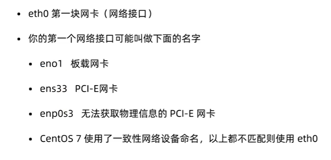

# 网络管理

## 网络状态查看

### ifconfig

**查看网络状态**



### mii-tool 

**查看网卡连接状况**

```
sudo mii-tool [网卡] 
```

### route

**查看网关**

```
route -n
```

## 网络故障排除

### ping

**检测连路是否畅通**

```
ping [ip地址]
```

### traceroute

**检测网络连接状况**

```
traceroute [ip地址]
```

### mtr

**检测网络连接状况**

### nslookup

**解析域名的ip地址**

```
nslookup www.baidu,com
```

### telnet

**检查端口连接状态**

```
telnet www.baidu.com 80
```

### tcpdump

**分析数据包**

### netstat

**检测服务范围**


