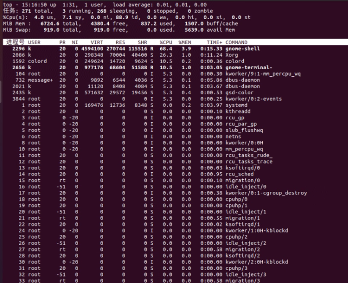

# 进程管理

## 进程查看

### ps

- `-e` 选项用于显示系统中所有进程，而不仅仅是当前用户的进程
- `-L` 选项用于显示进程的线程信息，包括线程ID、线程的状态、线程所属的进程ID等
- `-f` 选项用于显示完整的进程信息，包括进程的UID、PPID、C（CPU使用率）、STIME（启动时间）等

**查看进程状态**

```
当前进程状态
ps

显示所有进程
ps -e

分页查看
ps -e | more
```

### pstree

**显示进程树状结构**

```
pstree | more
```

### top

**查看进程信息**



- `load average` 表示平均负载 1表示满负载 （1分钟，5分钟，15分钟）
- `1:31` 最近一次开机到现在的时长
- `任务` 系统有多少个任务在执行
- `running` 多少个在运行态
- `sleeping` 多少个在休眠态
- `stoping` 停止
- `%Cpu(s)` cpu运行信息（总分配数量为%100 根据信息查看cpu分配是否合理）
- `us` 多少cpu的运算量用于用户计算
- `sy` 多少cpu的运算量用于系统计算
- `wa` io磁盘操作(查看io操作是否过慢)
- `total` 一共有多少内存
- `free`  多少内存没有使用
- `used` 多少内存正在使用
- `bufer/cache` 多少内存在读写缓存
- `swap` 交换分区 windows的虚拟内存

```
top
```

## 进程控制

### nice

**调整优先级 范围从-20到19 值越小优先级越高，抢占资源越多**

### renice 

**重新设置优先级**

###  jobs

**停止进程，并不是杀死**

```
前台启动
fg 1
后台启动
bg 1
```

### kill

**信号**

```
查看所有信号
kill -l

杀死进程
kill -9 [进程id]
```

## 守护进程 （deamon）

**守护进程通常在系统启动时启动，并在系统关闭时关闭，其主要目的是在后台执行特定的系统任务或服务，如网络服务、日志记录、定时任务**

### nohup

**即使当前终端会话结束或用户注销，也能保持命令继续执行**

```
后台执行tail命令，即使关闭终端tail指令依旧运行 
nohup tail -f a.txt &
```

