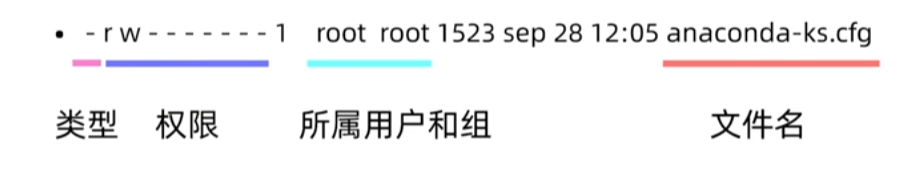
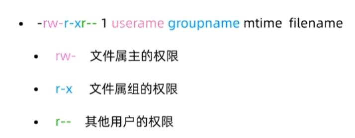

# 用户与权限管理

## 用户权限

### useradd

**新建用户**

```
useradd username
```

### userdel

**删除用户**

```
userdel username
```

### passwd

**修改用户密码**

```
创建原始密码
passwd

更改用户密码
sudo passwd username
```

### usermod

**修改用户属性**

- `-l new_username`：修改用户的登录名（用户名）
- `-u new_uid`：修改用户的用户ID（UID）。这个操作需要谨慎，因为用户ID是系统中用户的唯一标识符
- `-g new_group`：修改用户的主用户组。可以指定用户帐户所属的新的主用户组
- `-G new_group1,new_group2,...`：修改用户的附加用户组。指定用户帐户所属的附加用户组列表
- `-d new_home_dir`：修改用户的家目录路径。可以指定一个新的路径作为用户的家目录

```
usermod [options] username
```

### chage

**修改用户属性**

- `-d last_day`：设置用户帐户的上次密码更改日期。可以指定一个日期，通常以天数表示。例如，`-d 0` 表示将密码更改日期设置为今天
- `-E expire_date`：设置用户帐户的密码过期日期。指定一个日期，用户帐户的密码在此日期后将过期
- `-l`：显示用户帐户的密码过期信息

```
chage [options] username
```

## 文件权限



**类型：**

- `- `：普通文件
- `d`：目录文件
- `b`：块特殊文件
- `c`：字符特殊文件
- `l`：符号链接
- `f`：命名管道
- `s`：套接字文件

**字符权限表示：**

- `r `：读	`w`：写	`x`：执行

**数字权限表示：**

- `r `：4	`w`：2	`x`：1

**目录权限表示方式：**

`x `：进入目录	`rx`：显示目录内的文件名	`wx`：修改目录内的文件名



### chmod

**修改文件或目录的权限**

```
chmod [选项] 模式 文件或目录

将文件 example.txt 设置为所有用户都可读写：
chmod ugo+rw example.txt

将目录 data 及其所有子目录和文件设置为所有用户可读、写入和执行：
chmod -R ugo+rwx data

将文件 script.sh 设置为所有者具有执行权限：
chmod u+x script.sh

数字形式：
所有者读写权限：4（读） + 2（写） = 6
组用户读权限：4（读）
其他用户读权限：4（读）
chmod 644 example.txt
```


