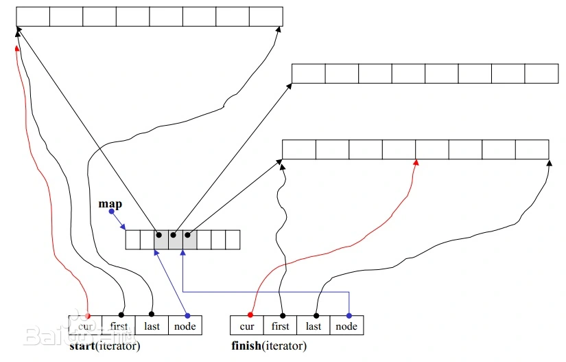
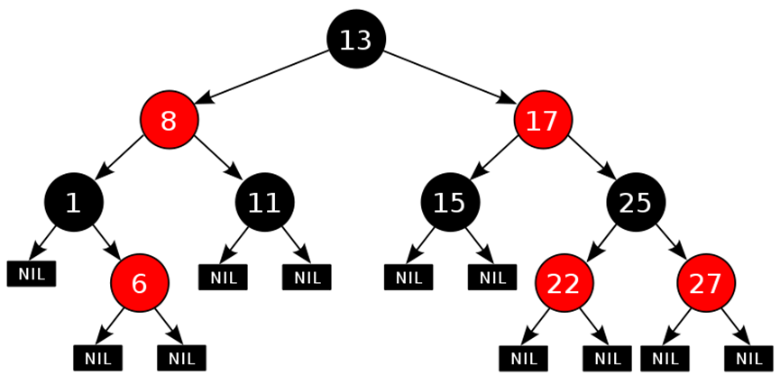

# deque
## 底层原理

deque是由一段段的连续内存空间，通过一个叫中控器的**map**指针数组组成，指针数组中的指针指向各自的内存空间，通过维护两个迭代器指针start和finish，一个指向第一个缓冲区，另一个指向最后一个缓冲区，来控制一段段内存之间的跳转
支持随机访问O(1)，但性能比vector要低；支持双端扩容，因此在头部和尾部插入和删除元素很快，为O(1)，但是在中间插入和删除元素O(n)

# set&map

## 底层原理

map和set底层都是由红黑树实现，红黑树是一种二叉搜索树，要求从一个节点到所有叶节点的路径中，最长路径不超过最短路径的2倍，所以红黑树只追求树的大致平衡，红黑树是一种弱平衡二叉树，相对于严格要求平衡的平衡二叉树来说，它的旋转次数少，所以对于插入、删除操作较多的情况下，通常使用红黑树。查询、插入和删除的时间复杂度维持在对数级别(O(logn))

**红黑树特性：**

- 每个节点是红色或者黑色
- 根节点是黑色
- 如果一个节点是红色，子节点必须是黑色
- 任意节点到每个叶节点的路径都包含数量相同的黑色节点

**二叉平衡树特性：**

- 左子树节点值小于根节点
- 右子树大于根节点
- 左右子树是一个二叉排序树
- 平衡因子值不超过1，保持平衡

# hash

## 底层原理

哈希表是通过键值映射直接访问数据的一种数据结构，通过将键映射到表中一个位置直接访问元素的函数叫**哈希函数**，

### 哈希冲突

哈希表存储数据时，两个或多个不同的键（Key）被哈希函数映射到同一个位置的情况，叫哈希冲突

- 开放地址法：
  -   一旦发生了冲突，就去寻找下一个空的散列表，只要散列表足够大，空的散列表地址总能找到，并记录存入
- 再散列函数法：
  -   这种方法是同时构造多个不同的哈希函数，当一个哈希函数地址还产生冲突时，在计算另一个哈希函数地址，直到不再发生冲突为止。
- 链地址法：
  -   将所有哈希地址相同的元素存储在一个单链表中，在哈希表中只存储所有链表的头指针
- 建立公共溢出区：
  -   将哈希表分为基础表和溢出表两部分，凡是和基本表发生冲突的元素，一律存入溢出表

## 红黑树和哈希表哈希表什么区别？

 1、hash查找速度会比RB树快，而且查找速度基本和数据量大小无关（直接根据键值对映射），属于常数级别。而RB树的查找速度是log(n)级别。**但是当元素的数量到一定数量级别时候，hash还有hash函数的耗时，不一定比红黑树快**

2、红黑树是有序的，Hash是无序的

3、红黑树占用的内存更小（仅需要为存在的节点分配内存），而Hash事先应该分配足够的内存来存储散列表

