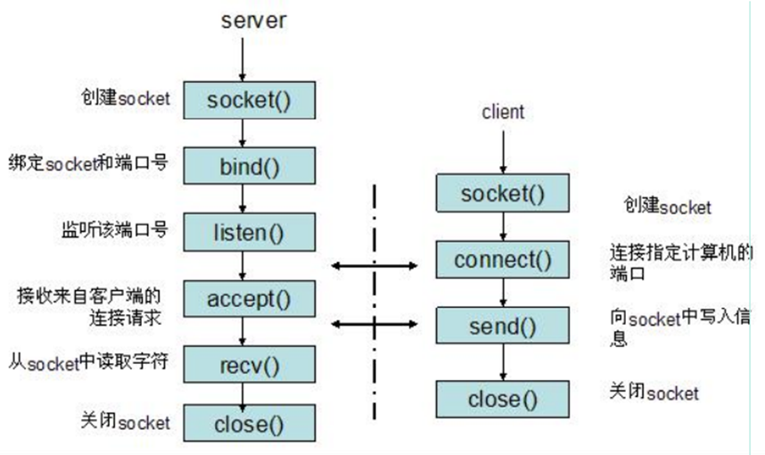

# socket

## TCP socket通讯

**基于TCP的socket:**

* 服务器端程序:
  * 创建一个socket, 用函数socket ()
  * 绑定IP地址、端口等信息到socket上，用函数bind()
  * 设置允许的最大连接数，用函数listen()
  * 接收客户端上来的连接，用函数accept()
  * 收发数据，用函数send()和recv()，或者read ()和write()
  * 关闭网络连接

* 客户端程序:
  * 创建一个socket,用函数socket ()
  * 设置要连接的对方的IP地址和端口等属性
  * 连接服务器，用函数connect()
  * 收发数据，用函数send()和recv()，或read()和write()
  * 关闭网络连接

# IO模型

 ## 阻塞和非阻塞

* 阻塞：只是针对线程挂起这一场景，线程无法获取 cpu 时间片，无法处理其他逻辑

* 非阻塞：线程正常获取 cpu 时间片，正常运行，可以不断轮询 read 函数，快速返回，同时也可以处理其他逻辑

* 结论：阻塞和非阻塞的区别，只是针对线程是否挂起（即能否获取 cpu 时间片）

## 同步和异步

* 同步：**线程自己**读取数据，不断地从内核缓冲区读取到应用程序缓冲区，直到读取所有数据。读数据期间线程忙个不停，疲于奔命（读数据这期间线程脱身去无法处理其他逻辑）
* 异步：**内核把所有数据写到应用程序**缓冲区，再通知应用程序处理。在通知之前，应用程序都可以去处理其他逻辑
* 结论：同步和异步的区别，只是针对谁将数据读到应用程序缓冲区。

