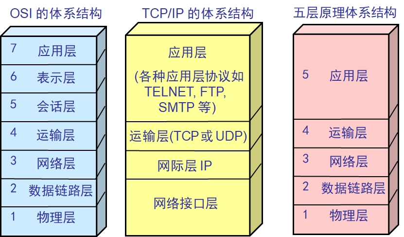
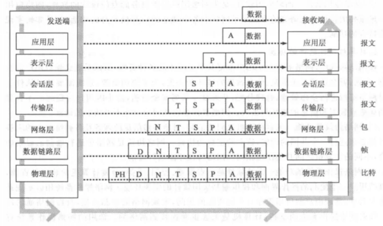

# 计算机网络通信的框架

## OSI七层模型

* 物理层：传输原始比特流，它定义了电气特性

* 数据链路层：负责将比特流转换为数据帧，并在相邻节点之间进行点到点传输
* 网络层（**ip协议**）：负责在网络上选择最佳的路径，并将数据分组进行传输
* 传输层（**tcp、udp**）：负责端到端的数据传输和通信（**主机中两个进程间的通信**），提供了数据的可靠传输、流量控制、拥塞控制等功能
* 会话层：负责建立、管理和终止会话（session）连接。它提供了数据的会话管理、同步和恢复功能
* 表示层：负责对数据进行翻译、加密和压缩
* 应用层（**http、https**）：负责提供网络服务和应用程序之间的接口

### OSI模型通讯过程

A主机，首先根据应用层提供的接口，将数据报文发送到表示层，如此继续直至物理层，物理层根据物理媒介将比特流发送到B主机，B主机之后再向上发送到数据链路层，数据链路层将比特流封装成帧数据发送到网络层，网络层在将数据封装成包发送给传输层，传输层封装成报文之后依次发送到应用层，完成通讯

## TCP/UDP

* tcp是面向连接的传输协议，传输前需要建立连接,udp无连接
* tcp是全双工的可靠通讯，udp是不可靠通讯
* tcp只支持点到点通讯，udp支持一对一，一对多，多对多通讯
* tcp是面向字节流传输，udp面向报文传输
* tcp首部开销大，udp首部开销小

### TCP三次握手

* 首先客户端发送YSN给服务器，请求建立连接，client进入SYN-SEND状态
* 服务端收到客户端发送过来的SYN，回复SYN+ACK，同意建立连接，server进入SYN-RCVCD状态
* 客户端收到服务端发送的SYN+ACK后，也发送一个ACK，表示收到服务端的确认报文
* 服务段收到客户端的ACK，连接建立，同时计入ESTAB-LISHED

#### 建立连接可以是两次握手吗

* **不可以**，可能出现已经失效的请求报文有传送到服务端
  * 因为网络阻塞，一个已经失效的报文过了一段时间后，又发送到了服务端，两次握手就会导致服务端认为建立了连接，而客户端却一直不发送资源
* Server也无法确认Client是否收到报文

#### 可以四次握手吗

可以浪费资源，三次握手是最少的连接次数

#### 客户端ACK未送到服务端，会怎样

* Server没有收到ACK确认，因此会重发之前的SYN+ACK（默认重发五次，之后自动关闭连接进入CLOSED状态），Client收到后会重新传ACK给Server

#### 建立连接后，客户端出现故障

发送探测报文，一定次数后关闭连接

### 四次挥手

* client发送FIN给服务端，请求关闭client到server的连接，客户端进入FIN-WAIT-1状态
* server收到client发送的请求，回复ACK，同意关闭连接，server进入CLOSE-WAIT状态，client收到后进入TIME_WAIT_2状态
* 当server的数据发送完后，向client端发送FIN+ACK，请求关闭server到client的连接，server进入LAST_ACK状态，等待client确认

* client收到server的 FIN+ACK，并回复 ACK 给server（同意释放从server到client的连接），此时client进入TIME_WAIT状态，等待2MSL，然后释放连接，进入CLOSED状态
* server收到ACK后，关闭连接，进入CLOSED

#### 为什么是四次挥手

tcp是全双工通讯，客户端到服务端的连接释放了，服务端的数据还没发送完，需要等服务端发送完数据，断开连接

#### 为什么客户端释放最后需要 TIME-WAIT 等待 2MSL 

* 为了保证客户端发送的最后一个 ACK 报文能够到达服务端。若未成功到达，则服务端超时重传 FIN+ACK 报文段，客户端再重传 ACK，并重新计时

* 防止已失效的连接请求报文段出现在本连接中。TIME-WAIT 持续 2MSL 可使本连接持续的时间内所产生的所有报文段都从网络中消失，这样可使下次连接中不会出现旧的连接报文段

### TCP可靠传输

* **序列号**：保证有序到达
* **应答机制**：收到数据后会回复一个ACK应答，确认收到数据
* **超时重传**： TCP 发出一个报文段后，会启动一个定时器，等待目的端确认收到这个报文段。如果超过某个时间还没有收到确认，将重发这个报文段
* **流量控制**：调整发送端发送数据的大小，防止产生丢包（发送数据太快，接收端没收到，导致丢包）**TCP首部的窗口**
* **拥塞控制**：防止过多的数据注入到网络中，使网络中的路由器或链路不致过载
  * **慢开始**：Tcp开始发送时不要一开始发送大量数据，先探测一下网络拥塞程度，由小到大逐渐增加拥塞窗口的大小
  * **拥塞避免**：当拥塞窗口达到一定阈值（通常是慢启动阈值）时，发送方进入拥塞避免阶段。在拥塞避免阶段，拥塞窗口以线性增长的方式增加，即每收到一个确认，拥塞窗口增加一个段
  * **快重传，快恢复**：当发送方检测到丢失了一个数据包时，会将拥塞窗口的大小减半，并进入快速恢复阶段。在快速恢复阶段，发送方会尝试重新发送丢失的数据包，而不是等待超时重传
